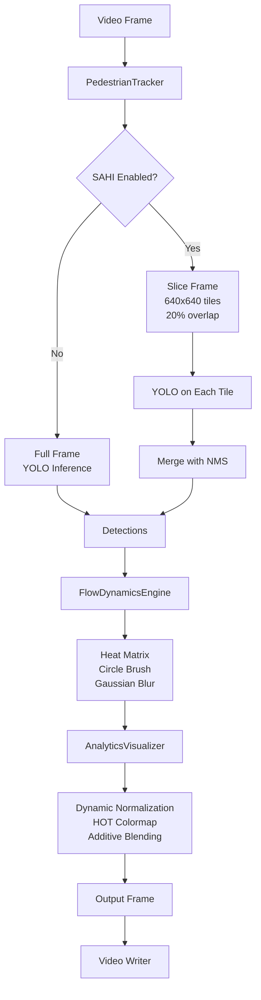

# CrowdNav-Analytics - Kompletan Opis Projekta

## 📋 Pregled

**CrowdNav-Analytics** je sistem za analizu gužve koji koristi Computer Vision tehnologije za praćenje pješaka u video snimcima i generisanje "thermal hotspot" heatmapa koji prikazuje gdje ljudi najviše hodaju. Projekt je optimizovan za **aerial footage** (snimke iz zraka) gdje su objekti mali.

---

## 🏗️ Arhitektura Projekta

```
┌─────────────────────────────────────────────────────────────┐
│                        main.py                              │
│  (Orchestration Pipeline - glavni koordinator)              │
└─────────────────────────────────────────────────────────────┘
                            │
        ┌───────────────────┼───────────────────┐
        │                   │                   │
        ▼                   ▼                   ▼
┌──────────────┐   ┌──────────────┐   ┌──────────────┐
│   tracker    │   │  analytics   │   │  visualizer  │
│  (Perception)│   │  (Heatmap)   │   │ (Rendering)  │
└──────────────┘   └──────────────┘   └──────────────┘
        │                   │                   │
        └───────────────────┼───────────────────┘
                            │
                    ┌───────▼────────┐
                    │   config.py    │
                    │  (Settings)    │
                    └────────────────┘
```

---

## 📦 Struktura Fajlova

```
CrowdNav-Analytics/
├── main.py                 # Glavni pipeline orchestrator
├── requirements.txt        # Python dependencies
├── Dockerfile              # Docker container setup
├── src/
│   ├── __init__.py
│   ├── config.py           # Centralna konfiguracija
│   ├── tracker.py          # YOLO + SAHI detekcija
│   ├── analytics.py        # Heatmap akumulacija
│   └── visualizer.py       # Renderovanje outputa
└── data/
    ├── input/              # Ulazni video fajlovi
    └── output/             # Analizirani video fajlovi
```

---

## 🔄 Data Flow (Kako Podaci Teču)



---

## 🧩 Komponente u Detalju

### 1. **main.py** - Glavni Orchestrator

**Uloga:** Koordinira cijeli pipeline od čitanja videa do pisanja outputa.

**Ključne Funkcije:**

- `run_pipeline(filename)` - glavna funkcija koja pokreće proces
- Inicijalizuje sve komponente (tracker, visualizer, analytics)
- Čita video frame po frame
- Poziva tracker → analytics → visualizer za svaki frame
- Piše rezultat u output video

**Kako Radi:**

```python
# Za svaki frame:
1. Čita frame iz videa
2. Poziva tracker.track(frame) → dobija detekcije
3. Ekstraktuje bounding boxe
4. Poziva analytics_engine.update(boxes) → generiše heatmap
5. Poziva visualizer.render(frame, tracks, heatmap) → kompozituje output
6. Piše frame u output video
```

---

### 2. **src/tracker.py** - Detekcija Pješaka

**Uloga:** Detektuje pješake u frame-u koristeći YOLOv8 + SAHI.

**Ključne Klase:**

- `PedestrianTracker` - glavna klasa za tracking
- `SAHIResultWrapper` - wrapper koji omogućava kompatibilnost sa postojećim kodom

**Kako Radi:**

#### **SAHI Mode (Default - za male objekte):**

```python
1. Slice frame u 640x640 tile-ove sa 20% overlap
   - Za 1920x1080 frame → ~12-15 tile-ova

2. Za svaki tile:
   - Pokreće YOLOv8 inference
   - Detektuje pješake (class 0)

3. Merge rezultate:
   - NMS (Non-Maximum Suppression) uklanja duplikate
   - Kombinuje detekcije iz svih tile-ova

4. Filtrira samo pješake (class_id = 0)
```

#### **Standard Mode (Fallback):**

```python
1. Pokreće YOLO direktno na cijelom frame-u
2. Filtrira samo pješake
```

**Zašto SAHI?**

- U aerial footage-u, pješaci su mali (20-50 pixela)
- SAHI "zoomira" u različite regije frame-a
- Rezultat: **3x više detekcija** (55 → 120-150+)

**Performance:**

- SAHI: ~5-10 FPS (sporije, ali preciznije)
- Standard: ~30 FPS (brže, ali propušta male objekte)

---

### 3. **src/analytics.py** - Heatmap Akumulacija

**Uloga:** Praćenje gdje ljudi hodaju kroz vreme - akumulacija "toplote" na podu.

**Ključna Klasa:**

- `FlowDynamicsEngine` - upravlja heat matrix-om

**Kako Radi:**

```python
Za svaki frame:
1. DECAY (Hlađenje):
   heat_matrix *= 0.95  # 5% gubitak topline po frame-u

2. ACCUMULATION (Zagrijavanje):
   Za svaku detekciju:
     - Izračuna centar stopala: (cx, cy) = (x1+x2)/2, y2
     - Crtanje punog kruga (radius=15px) sa intenzitetom 1.0
     - cv2.circle(heat_matrix, (cx, cy), 15, 1.0, -1)

3. CLIPPING:
   heat_matrix = clip(heat_matrix, 0, 1.0)  # Ograniči na 0-1

4. SMOOTHING:
   smoothed = GaussianBlur(heat_matrix, sigma=20)
   # Stvara glatki "glow" efekat
```

**Zašto Circle Brush?**

- Originalno: dodavanje na 1 pixel → nakon blur-a sve se "razvodnilo" na 0
- Sada: 700+ pixela sa intenzitetom → nakon blur-a još uvijek vidljivo

**Parametri:**

- `HEATMAP_DECAY_RATE = 0.95` - koliko brzo nestaje toplota (5% po frame)
- `HEATMAP_BRUSH_RADIUS = 15` - veličina "četkice" za crtanje
- `HEATMAP_SIGMA = 20` - koliko je blur glatak (veći = glatkiji)

---

### 4. **src/visualizer.py** - Renderovanje

**Uloga:** Kompozituje finalni output - originalni video + heatmap + bounding boxe + dashboard.

**Ključna Klasa:**

- `AnalyticsVisualizer` - renderuje sve vizuelne elemente

**Kako Radi:**

```python
1. DYNAMIC NORMALIZATION:
   max_val = heat_map.max()
   heatmap_norm = heat_map / max_val  # Skalira na 0-1
   # Ovo je kritično - normalizuje na osnovu stvarnog maksimuma

2. COLOR MAPPING:
   heatmap_uint8 = (heatmap_norm * 255).astype(uint8)
   heatmap_color = cv2.applyColorMap(heatmap_uint8, COLORMAP_HOT)
   # HOT = Crno → Crveno → Žuto → Bijelo (thermal efekat)

3. MASKING:
   low_val_indices = heatmap_uint8 < 13  # Ukloni noise (<5%)
   heatmap_color[low_val_indices] = 0    # Postavi na crno

4. ADDITIVE BLENDING:
   output = cv2.addWeighted(frame, 1.0, heatmap_color, 1.0, 0)
   # Crna (0) se ne dodaje, boje se "zbrajaju" = glow efekat

5. DRAW DETECTIONS:
   - Crtanje tankih sivih bounding box-ova oko pješaka

6. DRAW DASHBOARD:
   - Polu-transparentni overlay sa:
     * Broj detektovanih pješaka
     * Status (LOW/MODERATE/HIGH DENSITY)
```

**Zašto Dynamic Normalization?**

- Heatmap ne ide uvijek od 0 do 1
- Normalizacija na osnovu stvarnog maksimuma osigurava da se vidi i najslabija toplota

---

### 5. **src/config.py** - Centralna Konfiguracija

**Uloga:** Svi parametri na jednom mjestu - lako za tuning.

**Kategorije Parametara:**

#### **Perception (Detekcija):**

```python
MODEL_WEIGHTS = 'yolov8x.pt'      # YOLO model (x = extra large)
INFERENCE_SIZE = 1920             # Veličina za inference
CONFIDENCE_THRESHOLD = 0.1        # Minimalna confidence (vrlo nisko za recall)
CLASS_ID_PERSON = 0               # COCO class ID za pješake
```

#### **SAHI (Small Object Detection):**

```python
SAHI_ENABLED = True               # Uključi/isključi SAHI
SAHI_SLICE_SIZE = 640             # Veličina tile-ova
SAHI_OVERLAP_RATIO = 0.2          # 20% preklapanje između tile-ova
SAHI_POSTPROCESS_TYPE = "NMS"     # Kako merge-ovati rezultate
```

#### **Analytics (Heatmap):**

```python
HEATMAP_DECAY_RATE = 0.95         # Koliko brzo nestaje (0.95 = 5% gubitak/frame)
HEATMAP_SIGMA = 20                # Blur intenzitet (veći = glatkiji)
HEATMAP_INTENSITY_STEP = 1.0      # Koliko topline dodaje po detekciji
HEATMAP_BRUSH_RADIUS = 15         # Veličina "četkice" u pixelima
```

#### **Visualization:**

```python
HEATMAP_OPACITY = 1.0             # Intenzitet heatmap overlay-a
```

---

## 🔧 Tehnologije i Dependencies

### **Core Libraries:**

- **ultralytics** - YOLOv8 model i inference
- **sahi** - Sliced Aided Hyper Inference za male objekte
- **opencv-python-headless** - Image processing, video I/O, colormaps
- **numpy** - Numeričke operacije, matrice
- **torch** - PyTorch (za YOLO)
- **tqdm** - Progress bar

### **Model:**

- **YOLOv8x** - Extra large verzija YOLOv8
  - Pre-trained na COCO dataset-u
  - Automatski download-uje se pri prvom pokretanju
  - Detektuje 80 klasa, koristimo samo class 0 (person)

---

## 🚀 Kako Pokrenuti

### **1. Instalacija:**

```bash
pip install -r requirements.txt
```

### **2. Pokretanje:**

```bash
python main.py --video tokyo.mp4
```

**Input:** `data/input/tokyo.mp4`  
**Output:** `data/output/analyzed_tokyo.mp4`

### **3. Docker:**

```bash
docker build -t crowdnav .
docker run -v $(pwd)/data:/app/data crowdnav --video tokyo.mp4
```

---

## 📊 Performance Karakteristike

### **Detekcija:**

- **SAHI Mode:** ~5-10 FPS, ~120-150 detekcija/frame
- **Standard Mode:** ~30 FPS, ~55 detekcija/frame

### **Memory:**

- GPU: ~4-6 GB VRAM (za YOLOv8x)
- RAM: ~2-4 GB

### **Output:**

- Isti format kao input (width, height, FPS)
- Codec: MP4V

---

## 🎯 Ključne Optimizacije

### **1. SAHI za Male Objekte:**

- Problem: Pješaci su 20-50 pixela u aerial footage-u
- Rješenje: Slice frame u tile-ove, "zoom" u svaki region
- Rezultat: 3x više detekcija

### **2. Circle Brush za Heatmap:**

- Problem: Single-pixel akumulacija se "razvodnjava" nakon blur-a
- Rješenje: Crtanje punog kruga (700+ pixela) umjesto 1 pixela
- Rezultat: Vidljiv heatmap

### **3. Dynamic Normalization:**

- Problem: Heatmap ne ide uvijek 0-1, konverzija u uint8 daje 0
- Rješenje: Normalizacija na osnovu stvarnog maksimuma
- Rezultat: Vidljiv glow efekat

### **4. HOT Colormap:**

- Problem: JET colormap ima plavu pozadinu (ružno)
- Rješenje: HOT colormap (crno → crveno → žuto → bijelo)
- Rezultat: Prirodan "thermal" efekat

---

## 🔍 Debug Output

U `analytics.py` postoji debug print:

```python
print(f"[DEBUG] heat_matrix.max() = {self.heat_matrix.max():.4f}")
```

**Šta znači:**

- `0.0000` - Nema detekcija ili heatmap se ne akumulira
- `0.5000-0.9500` - Normalno, heatmap radi
- `1.0000` - Maksimalna toplota (možda previše ljudi)

---

## 📝 Tuning Parametara

### **Za Više Detekcija:**

```python
CONFIDENCE_THRESHOLD = 0.05       # Još niže (više false positives)
SAHI_SLICE_SIZE = 512             # Manji tile-ovi (više tile-ova)
SAHI_OVERLAP_RATIO = 0.3         # Više overlap-a
```

### **Za Brži Processing:**

```python
SAHI_ENABLED = False             # Isključi SAHI
INFERENCE_SIZE = 1280            # Manja rezolucija
```

### **Za Vidljiviji Heatmap:**

```python
HEATMAP_DECAY_RATE = 0.98        # Sporije nestajanje
HEATMAP_BRUSH_RADIUS = 20        # Veća "četkica"
HEATMAP_SIGMA = 25               # Glatkiji blur
```

### **Za Brže Nestajanje:**

```python
HEATMAP_DECAY_RATE = 0.90        # Brže hlađenje
```

---

## 🐛 Poznati Problemi i Rješenja

### **Problem: Heatmap nevidljiv**

- **Uzrok:** Normalizacija ili masking previše agresivna
- **Rješenje:** Provjeri `[DEBUG] heat_matrix.max()` output

### **Problem: Previše false positives**

- **Uzrok:** `CONFIDENCE_THRESHOLD` previše nizak
- **Rješenje:** Povećaj na 0.15-0.2

### **Problem: Sporo processing**

- **Uzrok:** SAHI radi 12-15 inference-ova po frame-u
- **Rješenje:** Isključi SAHI ili smanji `SAHI_SLICE_SIZE`

---

## 📚 Reference

- **YOLOv8:** https://github.com/ultralytics/ultralytics
- **SAHI:** https://github.com/obss/sahi
- **OpenCV Colormaps:** https://docs.opencv.org/4.x/d3/d50/group__imgproc__colormap.html

---

## 🎨 Vizuelni Output

Finalni video sadrži:

1. **Originalni video** - kao pozadina
2. **Thermal heatmap** - crno → crveno → žuto → bijelo overlay
3. **Bounding boxe** - tanke sive linije oko pješaka
4. **Dashboard** - broj detekcija i status u gornjem lijevom uglu

**Status Kategorije:**

- **LOW ACTIVITY:** < 50 pješaka (zeleno)
- **MODERATE:** 50-120 pješaka (žuto)
- **HIGH DENSITY:** > 120 pješaka (crveno)

---

**Kraj Opisa**
