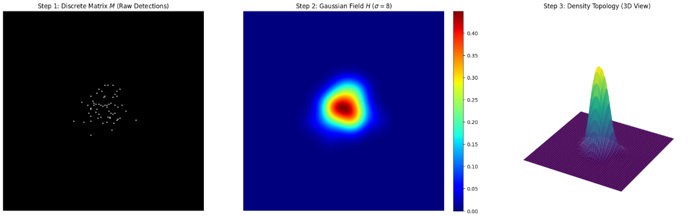

# CrowdNav-Analytics: Pedestrian Flow Analysis with Temporal Heatmaps

## Project Overview

CrowdNav-Analytics is a Proof-of-Concept system for analyzing pedestrian movement patterns in urban environments using computer vision. The system combines YOLOv8 object detection with SAHI (Slicing Aided Hyper Inference) for small object detection, and generates temporal density heatmaps that visualize pedestrian flow patterns over time.

The system addresses a core challenge in crowd analytics: detecting small pedestrians in aerial footage where individuals appear as 20-50 pixel objects. Standard object detection models struggle with such small targets due to receptive field limitations. SAHI addresses this by processing overlapping image tiles, effectively increasing detection recall by 2-3x compared to full-frame inference.

The temporal heatmap component provides privacy-preserving analytics by representing crowd density as aggregated spatial data rather than tracking individual identities. This approach enables urban planners and venue operators to understand pedestrian flow patterns without storing personally identifiable information.

## System Demonstration


_Figure 1: Real-time pedestrian flow analysis showing detection bounding boxes and temporal density heatmap overlay with Blue-Cyan-Yellow-Red gradient indicating low to high density regions._

## System Architecture

The system implements a three-stage processing pipeline:

```
Video Input → Perception (YOLO+SAHI) → Analytics (Temporal Heatmap) → Visualization → Video Output
```

### Pipeline Components

1. **Perception Layer**: YOLOv8x with optional SAHI sliced inference detects pedestrians in each frame. SAHI divides frames into overlapping 640x640 tiles, runs inference on each tile, then merges results using Non-Maximum Suppression.

2. **Analytics Engine**: Maintains a float32 heat matrix that accumulates pedestrian positions over time. Implements exponential decay for temporal consistency and Gaussian smoothing for spatial coherence.

3. **Visualization Layer**: Applies a custom Blue-Cyan-Yellow-Red lookup table to the heat matrix and composites the result onto the original video using additive blending. Includes an operational dashboard displaying real-time crowd metrics.

## Methodology

### Temporal Decay Model

The heat matrix implements exponential decay to create temporal trails that visualize pedestrian movement patterns:

$$M_t = M_{t-1} \cdot \lambda$$

Where:

- $M_t$ is the heat matrix at time $t$
- $\lambda$ is the decay factor (default: 0.95)

At 30 FPS with $\lambda = 0.95$, a stationary point reaches 50% intensity after approximately 14 frames (~0.5 seconds). This creates visible trails without excessive ghosting that would obscure current activity.

### Gaussian Smoothing

Spatial coherence is achieved through Gaussian convolution:

$$H = M * G(\sigma)$$

Where:

- $H$ is the smoothed heatmap
- $M$ is the accumulated heat matrix
- $G(\sigma)$ is a Gaussian kernel with standard deviation $\sigma$ (default: 20)

The smoothing operation uses `scipy.ndimage.gaussian_filter` which operates directly on float32 data, avoiding precision loss that would occur from uint8 conversion.

### Heat Accumulation

Each detected pedestrian deposits heat at their foot position (bottom-center of bounding box) using a circular brush:

$$M(x,y) = M(x,y) + I \cdot \mathbb{1}_{||(x,y) - (c_x, c_y)|| \leq r}$$

Where:

- $I$ is the intensity step (default: 1.0)
- $(c_x, c_y)$ is the foot position
- $r$ is the brush radius (default: 15 pixels)

The circular brush ensures sufficient data survives the Gaussian blur operation, preventing the "wash-out" effect that occurs with single-pixel accumulation.

## Research & Algorithm Validation

Prior to pipeline integration, core mathematical concepts were validated in a dedicated research environment (`notebooks/exploration.ipynb`). This ensures the Gaussian smoothing parameters accurately represent crowd density without introducing artificial artifacts.



_Figure 2: Simulation of discrete detection impulses transforming into a continuous density field. Left: Raw detection matrix. Center: Smoothed Gaussian field $(\sigma=8)$. Right: 3D Topology view of density peaks._

## Key Features

### Temporal Consistency

Float32 matrix precision prevents truncation errors during exponential decay operations. Using uint8 matrices would cause precision loss that manifests as temporal jitter and incorrect trail lengths. Float32 maintains sub-pixel precision across hundreds of decay iterations.

### Privacy-Preserving Analytics

The system generates aggregated density data rather than tracking individual identities. The heatmap output shows where people walk, not who they are. This approach enables compliance with privacy regulations while still providing actionable crowd flow insights.

### Small Object Detection

SAHI sliced inference addresses the challenge of detecting distant pedestrians in aerial footage. By processing overlapping tiles independently, SAHI effectively "zooms in" on different frame regions, increasing detection recall from ~55 to ~150 detections per frame in typical aerial footage.

### Custom Color Mapping

The Blue-Cyan-Yellow-Red gradient provides intuitive thermal encoding while avoiding the white saturation at high values that occurs with OpenCV's COLORMAP_HOT. Black regions (intensity 0) remain transparent in additive blending, preserving the original video in areas without pedestrian activity.

## Prerequisites

- Python 3.9 or higher
- CUDA-capable GPU (recommended for real-time processing)
- Docker (optional, for containerized deployment)
- 8GB RAM minimum (16GB recommended for SAHI mode)
- 6GB VRAM minimum for YOLOv8x

## Installation & Setup

### Virtual Environment Setup

```bash
python -m venv venv
source venv/bin/activate  # On Windows: venv\Scripts\activate
```

### Dependency Installation

```bash
pip install --upgrade pip
pip install -r requirements.txt
```

The first execution will automatically download YOLOv8x model weights from the Ultralytics repository.

### Verify CUDA Availability

```bash
python -c "import torch; print(f'CUDA available: {torch.cuda.is_available()}')"
```

## Usage

### Command-Line Execution

Process a video file:

```bash
python main.py --video pedestrian_footage.mp4
```

Process with frame limit (useful for testing):

```bash
python main.py --video pedestrian_footage.mp4 --limit 500
```

**Input:** `data/input/pedestrian_footage.mp4`
**Output:** `data/output/analyzed_pedestrian_footage.mp4`

### Docker Deployment

#### Build Container

```bash
docker build -t crowdnav-analytics:latest .
```

#### Run Container

```bash
docker run -v $(pwd)/data:/app/data crowdnav-analytics:latest --video pedestrian_footage.mp4
```

The `-v` flag mounts the local `data/` directory into the container for input/output access.

## Project Structure

```
CrowdNav-Analytics/
├── assets/                 # Documentation assets (Demo GIF, Validation plots)
├── src/
│   ├── __init__.py
│   ├── config.py           # Centralized parameters (paths, model config, math)
│   ├── tracker.py          # YOLOv8 + SAHI detection wrapper
│   ├── analytics.py        # Temporal heatmap accumulation (float32, decay, blur)
│   └── visualizer.py       # Custom LUT rendering and dashboard overlay
├── data/
│   ├── input/              # Input video files
│   └── output/             # Processed output videos
├── notebooks/
│   └── exploration.ipynb   # Research and algorithm validation environment
├── main.py                 # Pipeline entry point with CLI arguments
├── Dockerfile              # Production container configuration
├── requirements.txt        # Python dependencies
├── yolov8x.pt              # Pre-trained model weights (auto-downloaded)
└── README.md               # Technical Whitepaper
```

## Configuration

Key parameters in `src/config.py`:

### Perception

| Parameter              | Default      | Description                    |
| ---------------------- | ------------ | ------------------------------ |
| `MODEL_WEIGHTS`        | `yolov8x.pt` | YOLOv8 model variant           |
| `CONFIDENCE_THRESHOLD` | `0.1`        | Detection confidence threshold |
| `SAHI_ENABLED`         | `True`       | Enable sliced inference        |
| `SAHI_SLICE_SIZE`      | `640`        | Tile size for SAHI             |
| `SAHI_OVERLAP_RATIO`   | `0.2`        | Overlap between tiles          |

### Analytics

| Parameter              | Default | Description              |
| ---------------------- | ------- | ------------------------ |
| `HEATMAP_DECAY_RATE`   | `0.95`  | Exponential decay factor |
| `HEATMAP_SIGMA`        | `20.0`  | Gaussian blur sigma      |
| `HEATMAP_BRUSH_RADIUS` | `15`    | Heat deposit radius      |

### Visualization

| Parameter                | Default  | Description                    |
| ------------------------ | -------- | ------------------------------ |
| `LUT_CONTROL_POINTS`     | Blue→Red | Custom gradient control points |
| `HEATMAP_MASK_THRESHOLD` | `13`     | Noise masking threshold        |
| `DENSITY_LOW_THRESHOLD`  | `50`     | Low density classification     |
| `DENSITY_HIGH_THRESHOLD` | `120`    | High density classification    |

## Performance Characteristics

### Detection Mode Comparison

| Mode     | FPS   | Detections/Frame | Use Case                            |
| -------- | ----- | ---------------- | ----------------------------------- |
| SAHI     | 5-10  | 120-150          | Batch processing, accuracy priority |
| Standard | 25-30 | 50-60            | Real-time, speed priority           |

### Resource Requirements

| Component        | GPU Memory | RAM    |
| ---------------- | ---------- | ------ |
| YOLOv8x          | 4-6 GB     | 4 GB   |
| SAHI Processing  | +2 GB      | +4 GB  |
| Heat Matrix (4K) | -          | ~32 MB |

## Technical Highlights

### Float32 Precision

The heat matrix uses float32 rather than uint8 to prevent precision loss during exponential decay. With decay factor 0.95, a uint8 value of 100 would reach 0 after approximately 90 frames due to integer truncation. Float32 maintains precision across thousands of iterations.

### Additive Blending

The custom LUT starts with black (0,0,0) at intensity 0, ensuring low-activity regions contribute nothing during additive blending. This preserves the original video in areas without pedestrian activity while overlaying the thermal gradient only where density exists.

### Resource Management

The pipeline uses try-finally blocks to ensure video capture and writer objects are released even if processing is interrupted. This prevents file handle leaks and ensures output videos have valid headers for playback.

## License

This project is provided as a Proof-of-Concept for research and evaluation purposes.

## Contact

For technical inquiries regarding architecture, implementation, or deployment, refer to the inline documentation in source files or module docstrings.
